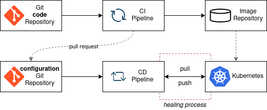
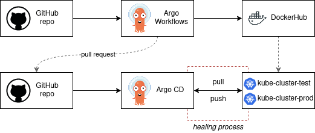

# GitOps Automation Project

Projecto de automatizacion de ciclo CI/CD en Kubernetes con Argo Workflows y Argo CD, utilizando GitHub y DockerHub como repositorios de codigo e imagenes, respectivamente. La idea final es lograr observabilidad en cada fase del ciclo y de las diferentes metricas de interes.

## Indice

- [GitOps Automation Project](#gitops-automation-project)
  - [Indice](#indice)
  - [Objetivos](#objetivos)
  - [Que esperar](#que-esperar)
  - [Que NO esperar](#que-no-esperar)
  - [Tecnologias Involucradas](#tecnologias-involucradas)
  - [GitOps](#gitops)
    - [Ventajas de GitOps](#ventajas-de-gitops)
    - [Kubernetes CI/CD](#kubernetes-cicd)
  - [Instalacion y Configuracion de Herramientas](#instalacion-y-configuracion-de-herramientas)
    - [Registrarse en GitHub, Bitnami y DockerHub](#registrarse-en-github-bitnami-y-dockerhub)
    - [Instalaciones en el sistema operativo](#instalaciones-en-el-sistema-operativo)
      - [Git](#git)
      - [Docker](#docker)
      - [MiniKube](#minikube)
      - [kubectl](#kubectl)
      - [Configuracion Minikube-kubectl](#configuracion-minikube-kubectl)
      - [Helm](#helm)
    - [Checkeo de instalaciones](#checkeo-de-instalaciones)
    - [Instalaciones de Herramientas CI/CD](#instalaciones-de-herramientas-cicd)

## Objetivos

El objetivo principal es establecer una pipeline CICD automatizada que optimice el ciclo de despliegue de software.

## Que esperar

En este repositorio encontraras informacion detallada de cada tecnologia y paso involucrados en el ciclo CI/CD, meticulosamente documentado y explicado.

## Que NO esperar 

- Esta **no** es una guia de aprendizaje de **Linux**.
- Esta **no** es una guia de aprendizaje de lenguajes de **programacion**.
- Esta **no** es una guia de aprendizaje de **Docker**.
- Esta **no** es una guia de aprendizaje de **Kubernetes**.
- Esta **no** es una guia de aprendizaje de Ingenieria de **Observabilidad**.

Si bien se utilizan todas estas tecnologias, se desean conocimientos previos basicos de Linux y Kubernetes, ya que las herramientas instaladas para la automatizacion del ciclo CI/CD corren sobre estas plataformas.
  
## Tecnologias Involucradas

- **Git**: Sistema de control de versiones distribuido.
- **GitHub**: Plataforma para el control de versiones con Git.
- **Docker**: Tecnología utilizada para la creación, implementación y gestión de contenedores.
- **DockerHub**: Plataforma para alojar imágenes de contenedores Docker, facilitando su distribución y uso.
- **Kubernetes**: Kubernetes facilita la gestión de múltiples contenedores, proporcionando capacidades avanzadas de orquestación, automatización y escalabilidad para aplicaciones en entornos de producción.
- **Minikube**: Herramienta que permite crear clústeres de Kubernetes locales para pruebas y desarrollo.
- **Helm**: Gestor de paquetes de Kubernetes que simplifica y automatiza tareas de implementación.
- **Bitnami**: Bitnami contribuye con una extensa colección de charts de Helm, simplificando la implementación de aplicaciones complejas en Kubernetes al ofrecer configuraciones predefinidas y listas para usar.
- **Argo** **Workflows**: Orquestador de flujos de trabajo complejos dentro de Kubernetes.
- **Argo** **CD**: Herramienta que facilita la implementación continua basada en GitOps para Kubernetes.
- **HashiCorp Vault**: Gestion de Secrets para Kubernetes
- **Grafana**: Plataforma para monitorear y visualizar datos provenientes de diversas fuentes.
- **Prometheus**: Sistema de monitorización y alerta de código abierto que recopila métricas de sistemas y servicios.

## GitOps

GitOps es una metodologia y practica que utiliza los repositorios Git como fuente **unica** de verdad par el despliegue de aplicaciones e infraestructura como codigo.

Si bien GitOps es un concepto **agnostico**, el framework GitOps puede construirse con herramientas como Git, Kubernetes, ArgoCD y Argo Workflows.

Las principales caracteristicas de GitOps son:

- **Declarativo**: Un sistema GitOps debe expresar su estado **deseado** de forma **declarativa**.
- Versionado: El estado deseado es **almacenado** para asegurar su **inmutabilidad y versionado**, reteniendo un historial completo de versiones.
- **Auto-Pull**: Agentes observan el estado deseado de la infraestructura de forma continua y realiazn el *pull* necesario.
- **Reconciliacion continua (*healing*)**: Los agentes observan de forma continua el estado actual del sistema y realizan acciones para lograr el estado deseado.

### Ventajas de GitOps

Con GitOps, las caracteristicas listadas previamente dan lugar a un ecosistema donde los cambios realizados en la infraestructura o en la aplicacion son rastreables y auditables. Este concepto beneficia a developers y equipos de operaciones para mejorar la respuesta ante problemas. Entre los principales beneficios cabe destacar:

- Consistencia Multicluster
- Seguridad Mejorada
- Visibilidad y auditoria de todos los cambios
- Estandarizacion de Workflow
- Automatizacion de proceso de integracion y despliegue

### Kubernetes CI/CD

Integracion Continua (CI) y Entrega Continua (CD) son metodos de despliegue de aplicaciones de forma automatica **entre cada ciclo** de desarrollo.

Con Kubernetes es simple implementar una pipeline CI/CD dentro de un cluster. El ciclo CI/CD se genera de la siguiente forma:

1. Un desarrollador implementa cambios en el codigo de una aplicacion.
2. El cambio se efectiviza en el **repositorio de codigo** (*GitHub*) y dispara la **pipeline CI** (*Argo Workflows*)
3. La pipeline compila, testea y buildea el codigo creando/actualizando una **imagen de contenedor**
4. La imagen se sube al **repositorio de imagenes** (DockerHub)
5. Un agente de herramienta CD (*Argo CD*) monitorea el repositorio de imagenes y detecta los cambios de configuracion.
6. La pipeline CD (*Argo CD*) actualiza los archivos de configuracion del repositorio de Git. (*GitHub*).
7. La herramienta CD (*Argo CD*) observa el nuevo estado deseado de la infraestructura y lo sincroniza con el estado actual del entorno Kubernetes. Este proceso es llamado **healing**

A continuacion se explican las palabras claves del texto anterior:

```md
- **Repositorio de código:** Lugar donde se almacena y gestiona el código fuente de un software. GitHub permite colaborar, versionar y controlar el código de los proyectos.

- **Contenedor:** Es una unidad de software ligera que incluye todo lo necesario para ejecutar una aplicación, como bibliotecas, código, tiempo de ejecución y dependencias. Los contenedores son independientes de la infraestructura y pueden ejecutarse de manera consistente diferentes entornos.

- **Imagen de contenedor:** Es la plantilla sobre la cual se basan los contenedores para ejecutar instancias específicas de una aplicación.

- **Repositorio de imágenes de contenedor:** Lugar donde se almacenan y organizan las imágenes de contenedor, por ejemploDockerHub. Estos repositorios permiten subir, descargar y gestionar imágenes de contenedor, lo que facilita la distribución y la implementación de aplicaciones en entornos basados en contenedores, por ejemplo un cluster Kubernetes.
```

Un ejemplo simplificado de un ciclo CI/CD explicado anteriormente se muestra a continuacion 





## Instalacion y Configuracion de Herramientas

Antes de comenzar a comprender los conceptos teoricos del ciclo CI/CD y que proporciona cada herramienta dentro del mismo, instalaremos todas las dependencias del proyecto. De esta manera no obstaculizaremos el avance del proyecto enredandonos con instalaciones que pueden resultar enrevesadas en muchos casos.

Al principio puede resultar tedioso realizar todas las instalaciones de una vez, pero trabajar en un entorno con todas las dependencias disponibles simplifica el proceso de aprendizaje notoriamente.

> Disclaimer: Las instalaciones se realizaran sobre un sistema operativo Ubuntu 22.04 en Enero 2024. Ante cualquier inconveniente se sugiere ir a la documentacion oficial de cada herramienta.

### Registrarse en GitHub, Bitnami y DockerHub

- Crear cuenta en [GitHub](https://github.com/)
- Crear cuenta en [DockerHub](https://hub.docker.com/)
- Crear cuenta en [Bitnami](https://bitnami.com/) (puede loguearse con la cuenta de GitHub creada previamente)

### Instalaciones en el sistema operativo

Las siguientes herramientas se instalaran dentro del sistema operativo con el cual interactuaremos con el cluster kubernetes.

#### Git

Git es el sistema de control de versiones que nos permite gestionar los cambios en el codigo al desarrollar software. Como su nombre lo indica, es la esencia misma de la metodologia GitOps, ya que en el control de versiones, colaboracion, automatizacion y gestion de cambios son la base de esta.

La mayoria de las distribuciones de Linux actuales disponen de Git. Podemos compprobarlo de la siguiente manera:

```sh
git --version
```

Si el comando resulta desconocido procedemos a instalarlo:

```sh
sudo apt update
sudo apt install git
git --version
```

#### Docker

Docker nos permite encapsular (*containerization*) aplicaciones y servicios en contenedores, permitiendo portabilidad y consistencia del entorno. Estas aplicaciones encapsuladas en contenedores seran almacenadas en registros de imagenes (DockerHub) y se ejecutaran en un orquestador de contenedores (Kubernetes).

Debido a que la instalacion de Docker Engine puede ser la mas compleja, dependiendo de configuraciones del sistema, se deja la [guia oficial](https://docs.docker.com/engine/install/ubuntu/) a disposicion.

#### MiniKube

Minikube es una herramienta que simplifica la ejecucion de un cluster Kubernetes de forma local, por lo que nos permite traajar en un ambiente Kubernetes en nuestra computadora sin las dificultades de configurar un cluster remoto.

```sh
curl -LO https://storage.googleapis.com/minikube/releases/latest/minikube-linux-amd64
sudo install minikube-linux-amd64 /usr/local/bin/minikube
```

Ante cualquier inconveniente se adjunta la [guia de instalacion](https://minikube.sigs.k8s.io/docs/start/)

#### kubectl

kubectl (de Kubernetes Controller) es una herramienta CLI (*Command Line Interface*) que nos permite interactuar y gestionar con clusteres Kubernetes. En este caso debemos interactuar con minikube, nuestro Kubernetes instalado de forma local previamente.

```sh
sudo apt-get update
sudo apt-get install -y apt-transport-https ca-certificates curl
curl -fsSL https://pkgs.k8s.io/core:/stable:/v1.29/deb/Release.key | sudo gpg --dearmor -o /etc/apt/keyrings/kubernetes-apt-keyring.gpg
echo 'deb [signed-by=/etc/apt/keyrings/kubernetes-apt-keyring.gpg] https://pkgs.k8s.io/core:/stable:/v1.29/deb/ /' | sudo tee /etc/apt/sources.list.d/kubernetes.list
```

o podemos utilizar snap

```sh
snap install kubectl --classic
kubectl version --client
```

verificamos la instalacion

```sh
kubectl version
```

#### Configuracion Minikube-kubectl

Para simplificar el uso de `minikube`con `kubectl` podemos agregar el siguiente *alias* al archivo de configuracion del shell que estemos usando 

```sh
alias kubectl="minikube kubectl --"
```

#### Helm

puede instalarse desde la Apt en Ubuntu

```sh
curl https://baltocdn.com/helm/signing.asc | gpg --dearmor | sudo tee /usr/share/keyrings/helm.gpg > /dev/null
sudo apt-get install apt-transport-https --yes
echo "deb [arch=$(dpkg --print-architecture) signed-by=/usr/share/keyrings/helm.gpg] https://baltocdn.com/helm/stable/debian/ all main" | sudo tee /etc/apt/sources.list.d/helm-stable-debian.list
sudo apt-get update
sudo apt-get install helm
```

Se deja la [documentacion oficial para la instalacion de Helm](https://helm.sh/docs/intro/install/).

### Checkeo de instalaciones

Una vez realizada las instalaciones, podemos proceder a comprobar si se instalaron correctamente

```sh
git version
docker version
kubectl version
minikube version
helm version
```

Si ningun comando resulta desconocido para la *shell*, ya estamos listo para **iniciar nuestro cluster minikube**

```sh
minikube start
```

```sh
kubectl get namespaces
```

Podemos observar el estado del cluster y de los recursos en el, de manera visual a traves de *minikube dashboard*

```sh
minikube dashboard
```

### Instalaciones de Herramientas CI/CD

Ya tenemos todas las herramientas instaladas en nuestro sistema operativo. Ahora nos toca instalar software en nuestor cluster Kubernetes (minikube).

> Disclaimer: Esta **no** es una guia de Kubernetes, y se requieren conocimientos basicos previos para que el presente documento no resulte confuso.

